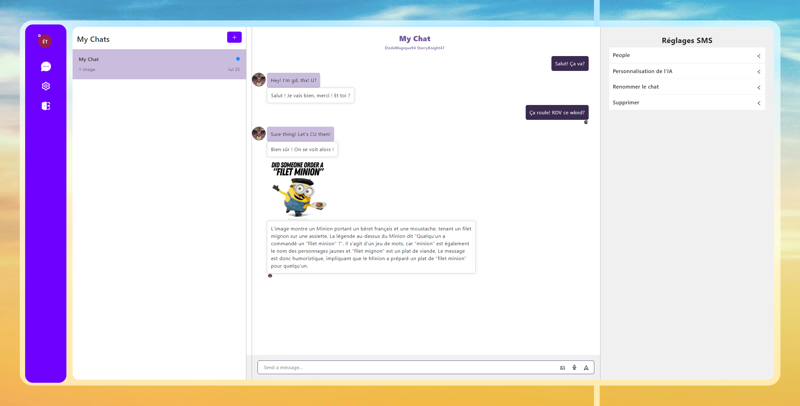

# LinguaLink: Real-Time Translation Chat App

Welcome to the LinguaLink App! Our application facilitates interaction between people speaking different languages in real-time. Whether you're chatting with friends, collaborating with colleagues, or exploring new cultures, our app breaks down language barriers and brings people closer together.

## 🌐 Team Website
Check out our team website for more information and updates: [Real-Time Translation App](https://sites.google.com/view/real-timetranslationapp/home)

## 📂 Project Structure
- **translation-app**: Contains our React application.
- **firebase**: Contains our Firebase application.

## 🚀 Features
- Real-time translation of chat messages.
- Supports multiple languages.
- User-friendly interface.
- Configurable translations.
- Multimodal input.

## 🛠️ Technologies & APIs Used
- **Chat Engine**: For real-time messaging.
- **Firebase Functions**: To handle server-side logic.
- **Firebase Store**: For data storage.
- **App Engine**: For deploying our app.
- **Gemini**: For advanced translation capabilities.

## 📸 Screenshots


## 🔧 Installation

1. Clone the repository:
    ```bash
    git clone https://github.com/your-username/real-time-translation-app.git
    ```

2. Navigate to the translation-app folder and install dependencies:
    ```bash
    cd real-time-translation-app/translation-app
    npm install
    ```

3. Navigate to the firebase folder and install dependencies:
    ```bash
    cd ../firebase
    npm install
    ```

## 🔑 Api-Keys

1. Create and obtain keys from [ChatEngine](https://chatengine.io/), [Firebase](https://firebase.google.com/), [Gemini](https://aistudio.google.com/app/apikey)

2. Navigate to the translation-app components folder and enter keys into Config
    ```bash
    cd real-time-translation-app/translation-app/src/components
    // Edit keys in Config.js.template
    mv Config.js.template Config.js
    ```

3. Navigate to the firebase functions folder and enter keys into Config
    ```bash
    cd ../../../firebase/functions
    // Edit keys in Config.js.template
    mv Config.js.template Config.js
    ```

## 🎉 Usage

1. Start the React application:
    ```bash
    cd translation-app
    npm start
    ```

2. Deploy Firebase functions:
    ```bash
    cd ../firebase
    firebase deploy --only functions
    ```

3. Access the app at `http://localhost:3000` and start chatting!

---

Thank you for checking out our project! We hope our Real-Time Translation Chat App helps you communicate seamlessly across different languages.
